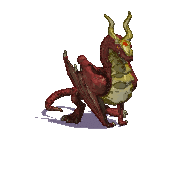

Kratemaqht on a Treadmill
==============================================================================

:Author:    Sandor Zsuga (Jubatian; CannonFodder)
:Copyright: 2015, GNU General Public License, Version 2, see COPYING.txt

Introduction
------------------------------------------------------------------------------

This is a small utility hastily whacked together to slim down the venerable
Kratemaqht dragon used in the Library of Kratemaqht and some other user-made
campaigns of Battle for Wesnoth. It may be used to trim down the size of
other image resources, too.

In short summary it relies on that png files compress better if there are less
distinct colors in them, however this far, there was no solution to perform
such operation in bulk, preserving the alpha channel of the image. This script
provides this solution.

Dependencies
------------------------------------------------------------------------------

The following additional packages are required to run this script:

- PNGCrush, tested with version 1.7.9.
- ImageMagick, tested with version 6.7.7-10.
- Gimp, tested with version 2.8. (Optional)
- The images/units/dragons directory (with contents) of the Library of
  Kratemaqht campaign (or whatever image source you need to crush).

If you are interested in the scolorq version, the source of scolorq can be
obtained here:

http://www.cs.berkeley.edu/~dcoetzee/downloads/scolorq

Note that scolorq itself apparently has some problems described further below
which likely prevents its practical use.

Running the ImageMagick or Gimp versions (recommended)
------------------------------------------------------------------------------

You need to perform the following steps to get a trimmed down set of your
images:

- Make sure you have ImageMagick, PNGCrush, and optionally Gimp installed.

- Run crush-gimp.sh or crush-magick.sh with the directory containing the
  images and the desired color count (64 is good for Kratemaqht), wait (a long
  time) and pray.

- Note that the images are overwritten with the trimmed down variants: you may
  want to run the script on a copy of the image directory.

Reducing Kratemaqht in the Wesnoth campaign to 64 colors gives at around 13
megabytes of images at a decent quality, fine for the purposes of the game.

The exact parameter signature of the script is as follows: ::

    ./crush-gimp image_directory color_count
    ./crush-magick image_directory color_count

The roles of the parameters are as follows:

- image_directory: The path where the images reside. The script will process
  every .png image within this directory (but won't enter sub-directories).

- color_count: The desired count of colors for the RGB portion of the image.
  The alpha channel is not affected, and is not included in this color count.

Gimp and ImageMagick's quantizer seems to offer quite similar performance in
terms of quality and compressibility.

The scolorq version
------------------------------------------------------------------------------

The scolorq version (crush-scolorq and scolorq-single for single images) uses
scolorq for quantizing the images. The crush-scolorq script can be used the
same way like the crush-gimp script, while scolorq-simple is provided to
replace the script coming with scolorq itself, automatically querying the
sizes of the image.

There are, however, two major problems with scolorq itself:

- Quality. While if used properly with manual tuning, it can be made producing
  better results than Gimp's quantizer, it doesn't work well in the practice
  for batch processing. The primary problem is that for some reason it
  produces a lot of identical (or almost identical) colors, so to actually get
  good results, you would have to set a higher quantization target, manually
  fixing the result afterwards. The set of actually different colors are
  usually a lot better than what Gimp gives for the same target, however
  without this it just doesn't work.

- Speed. It is crawling. It would take probably a day to quantize the entire
  dragons directory of Library of Kratemaqht with it at a reasonable quality.

These scripts however might be useful as templates for building and trying out
other, experimental quantizers without the need to actually implement handling
a known image format.

Some notes on other alternatives
------------------------------------------------------------------------------

The following other alternatives might exist:

- The pngnq package. The results from this, however, were very unsatisfactory:
  on every configuration I tried, it removes the shining gem on the forehead
  of the dragon, and the eyes. Gimp's quantizer is a lot better in this
  respect.
